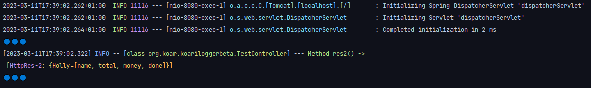
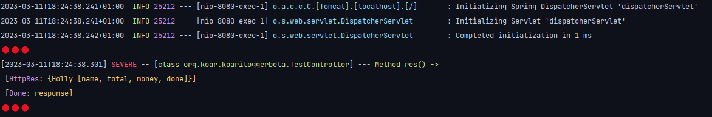
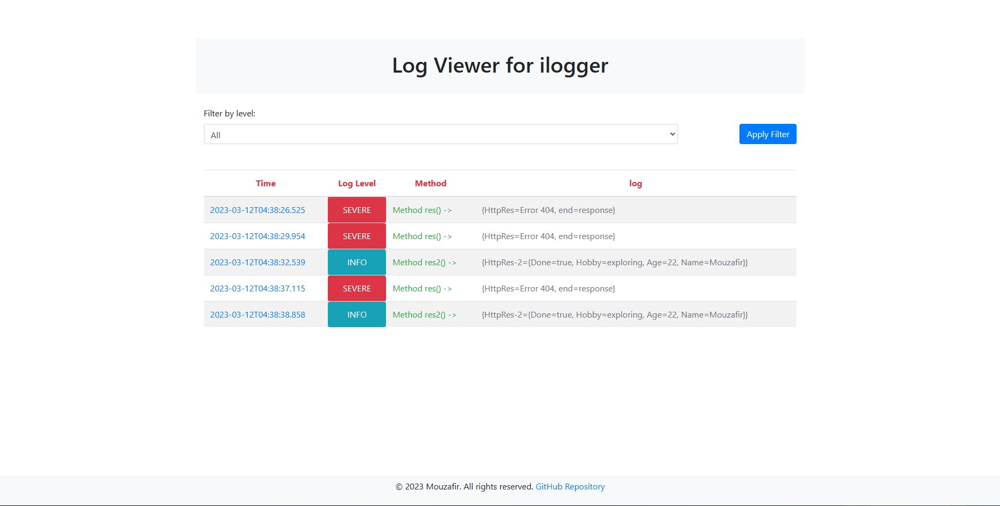

# Ilogger

Ilogger is intended to be a library for customized logging and debugging in Spring Boot applications. It provides a simple way to intercept and log HTTP requests and responses, as well as custom log messages.
This is the actual project.

## Table of Contents

- [Latest Feature](#latest-feature)
- [Getting Started](#getting-started)
- [Usage](#usage)
- [Configuration](#Configuration)
- [Demo](#Demo)
- [Authors](#Authors)
- [Contributing](#Contributing)
- [License](#license)

## Latest Feature

```diff
+ The logs captured by the @Ilog annotation are now formated to be displayed in a more readable way, Html format.
```

- The default port is `8080` for the websocket server.
- The html page to see log reports , is located at [web-logger](https://github.com/abderox/Ilogger-spring-boot/tree/main/web-logger) directory.
- You can also open it directly when the server launches up through http://localhost:8080/ilogger-viewer.html, but make sure the server is running and the file is in `resources/static` directory.

## Getting Started

### Prerequisites

- Java 17
- Maven 3.8.1
- jdk 18

### Usage

- To use the `@Ilog` annotation, simply add it to any method you want to log
    
```java
    @Ilog
    public void logMethod() {
        LoggingContext.put("key1", "value1");
        // do something
        LoggingContext.put("key2", 123);
    }
```

- By default, the `@Ilog` annotation logs the method call and return value at the INFO level. You can customize the logging level by specifying the level provided by `Levels` enum.
    
```java
    @Ilog(level = Levels.INFO)
    public void logMethod() {
        LoggingContext.put("key1", 123);
        // do something
        LoggingContext.put("key2", 123);
    }
```

- A cleaner way , is to use the `@Ilog` annotation with the `keys` parameter. This way, you can specify the keys used, so it could be suppressed from the `LoggingContext`.

```java
    @Ilog(level = Levels.SEVERE , keys ={"key1","key2"})
    public void logMethod() {
        LoggingContext.put("key1", 123);
        // do something
        LoggingContext.put("key2", 123);
    }
```

### Configuration

- To disable the `@Ilog` annotation, you can set the `ilogger.annotation.enabled` property to `false` in the `application.properties` file.

```properties
    ilogger.annotation.enabled = false
```

- If you feel like changing the colors or the emojis , go to [ILayout.java](https://github.com/abderox/Ilogger-spring-boot/blob/main/src/main/java/org/koar/koariloggerbeta/ilogger/ILayout.java)
- If you feel like changing the format of the log report on the console , go to [CustomFormatter.java](https://github.com/abderox/Ilogger-spring-boot/blob/main/src/main/java/org/koar/koariloggerbeta/ilogger/CustomFormatter.java)

## Demo

- To run the demo, you can use the following command:

```bash
    mvn spring-boot:run
```

- Then, you can access the following endpoints: I have provided a TestController for testing purposes.

```bash
    http://localhost:8080/hello-test
```

```bash
    http://localhost:8080/hello-test-2
```

<p
    align="center"
>
<span>Info level</span>
    
<span>Severe level</span>

<span>Html report</span>

</p>

## Authors

- [@Mouzafir](https://www.github.com/abderox)

## Contributing

Any contributions you make are **greatly appreciated**.

1. Fork the Project
2. The process is clear.

## License

Distributed under the MIT License. See `LICENSE` for more information.

[Back to Table of Contents](#table-of-contents)


  


